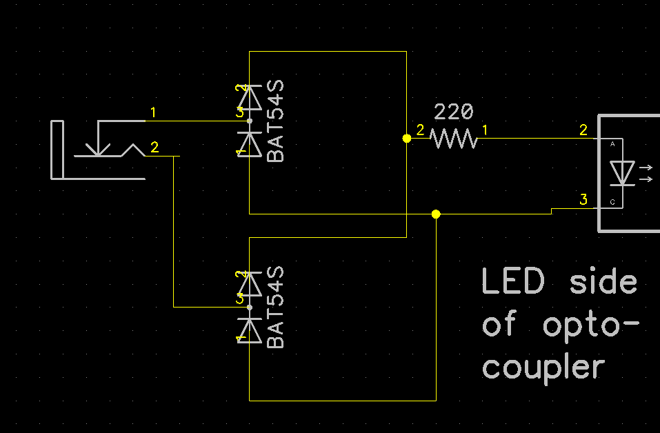

# PSI MIDI
This can be added to any device that uses 3.5mm TRS MIDI in. It makes your device "not care" is the incoming midi cable is "A" or "B". 

The circuit has been used on several devices without any trouble.

#notes:

ground is not needed on the input jack, it could cause a ground loop if the source device and your device are otherwise connected (through an audio cable for example)

The resistor, opto coupler, and jacks are your existing ones, the only new components you would add yo your BOM are the 2 BAT54S diodes.

Don't substituste other letter suffixed BAT54, they are not graded by letter, but wired differently in the package.

The jack shown in the schematic is wrong (due to laziness), the inputs should be connected to the tip and ring of a 3.5mm TRS jack.
